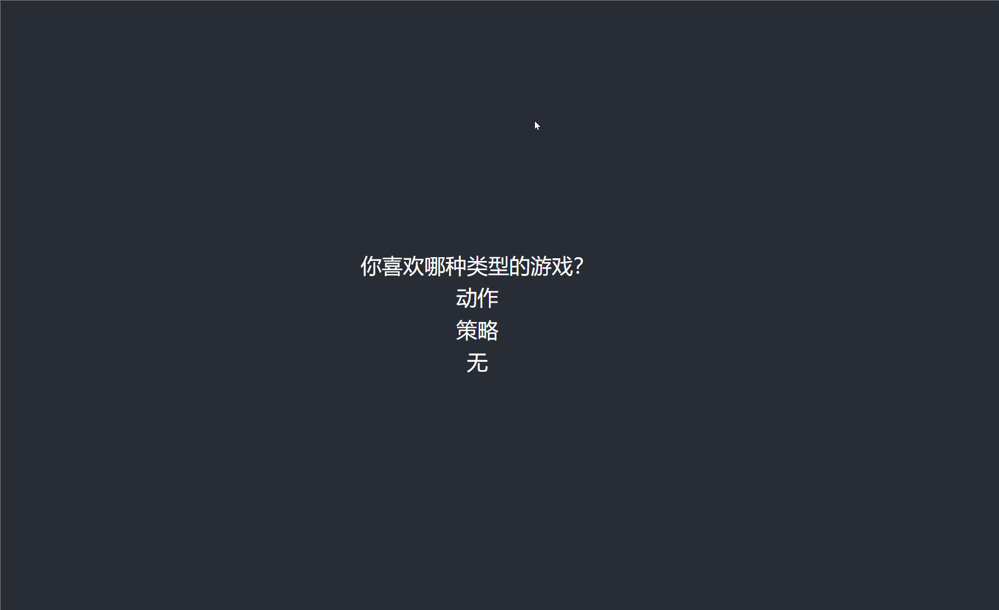

# 交互式问卷的实现，通过DSL的方式

参考腾讯问卷，自定义一段DSL
```
  if (Q1.answer == 0) then show Q2
  if (Q1.answer == 1) then show Q3
```

如果问题1的选项为0，展示问题2。如果问题1的选项为1，展示问题3。



**运行**
```
npm i 
npm start
```

本项目为学习、展示技术目的。前端实际开发中，如果不做低代码平台，甚至可以直接写一段完整JS代码让后端传给前端来运行控制问卷的逻辑，不需要DSL。。。

（开发完善中。。。）

# Implementation of interactive questionnaire through DSL

Customize a DSL
```
  if (Q1.answer == 0) then show Q2
  if (Q1.answer == 1) then show Q3
```


If the selected option for question 1 is 0, display question 2.If the selected option for question 1 is 1, display question 3.


**How to start**
```
npm i 
npm start
```

This project is for learning and showing skills purposes. In actual frontend development, if a low-code platform is not utilized, it is even possible to directly write a complete JavaScript code segment for the backend to pass to the frontend to execute and control the logic of a questionnaire. Using DSL is not necessary...

(Under development...)
